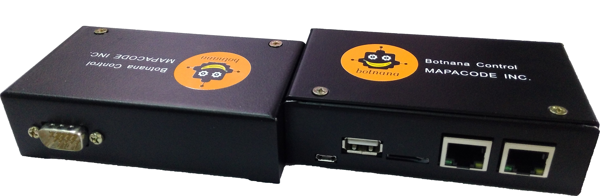

# Introduction

Botnana Control is an Industrial Ethernet EtherCAT controller’s rapid development and learning environment. 
The goal of Botnana Control is to help users rapidly develop automation 
and IIoT (Industrial Internet of Things) applications based on Industrial Ethernet.

## Applicable Field

Botnana Control can be utilized for following applications:

* Data collection: For use with Remote Terminal Unit (RTU).
* Data analysis: Analyze collected data with built-in spreadsheet and Javascript.
* Motion control: Up to 32 axes can be controlled with EtherCAT through Botnana Control. Currently supports Delta and Panasonic’s EtherCAT motor.
 Will support Coply, Sanyo Denki and Yaskawa EtherCAT’s motor and pulse input modules.
* PLC-like control: Botnana can utilize EtherCAT module and conduct PLC-like control. Currently support Delta and Beckhoff’s IO module.
* Cloud and user HMI integration: Utilizing built-in websocket server and client’s cloud service or HMI integration.
* CNC controller
