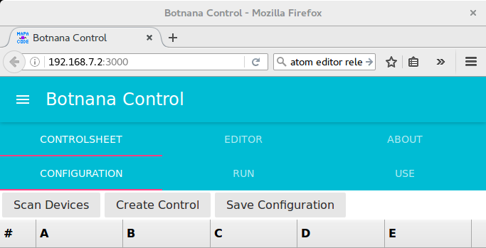

## Botnana Control Tutorial

Botnana Control Introduction

By default, Botnana A2 launches Botnana Control P2P Axes control software, by MAPACODE INC, on startup. 
Installed at `/opt/mapacode/botnana-control`

Accessing http://192.168.7.2:3000 with the browser will show you this screen:

If your Botnana A2 does not have Botnana Control P2P installed, 
you can install it with the following command:

    dpkg -i botnana-control_0.0.1-1_armhf.deb

Uninstall  with the following command:

    dpkg -r botnana-control

### Configuration

Please refer to [Configuration File](./configuration-file.md) chapter. 
ONLY edit the configuration file when in need.

// Edit the configuration file carefully
